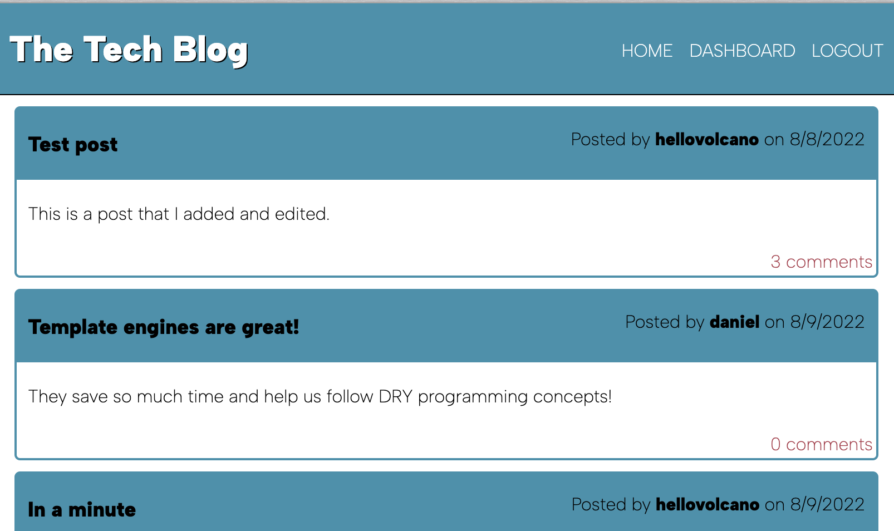

# The Tech Blog

The tech blog is a CMS-backed blogging site that users can create and share blog posts, as well as add comments. The application features user authentication, and is backed by a MySQL databases implemented with Sequelize.

### Links
[Deployed Application](https://cryptic-forest-67933.herokuapp.com/)

## Installation Instructions
Complete the following to run this code locally:

1. Clone the repo.
2. Run npm install at the root folder of this project
3. Create a .env file at the root folder of this project with the following format:   
            DB_NAME='sparky_tech_blog'  
            DB_USER='your-mysql-username'  
            DB_PASSWORD='your-mysql-password'  
4. Open a mysql shell and run source db/schema.sql.
5. Quit the mysql shell and run npm start.
6. Once you've started the server, access the app at http://localhost:3001

## Questions

For issues or questions, contact [Valerie](https://www.github.com/hellovolcano) at[hellovolcano@gmail.com](mailto:hellovolcano@gmail.com)
